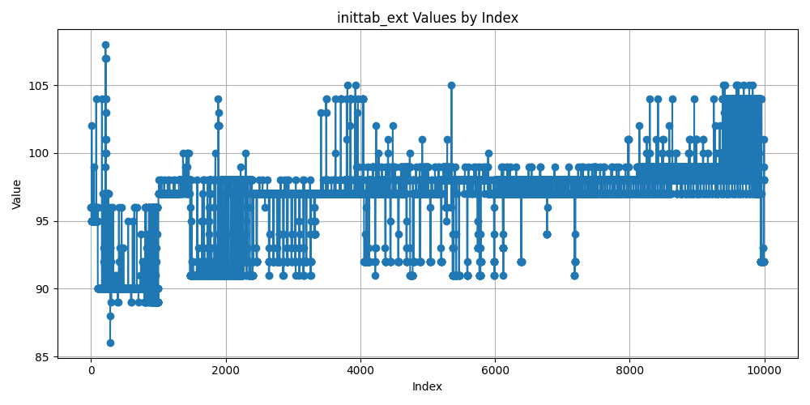

# Python C-API Embedding Demo: inittab scaling

```sh
export PYTHON_HOME="<path to a 3.15 cpython debug build>"
make clean && make && ./demo script.py -e 10000 2>out.json
```

Post process `out.json` a bit, run 2-3 times, and visualize

```sh
./visualize.py processed.*.json
```

## Results

Using 3.15



Using 3.15 with added `break`


